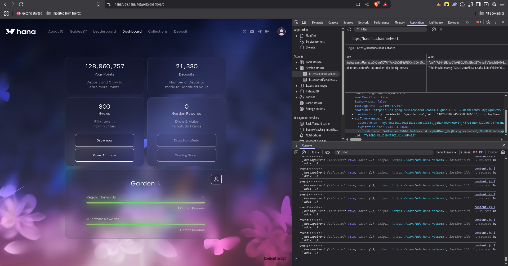
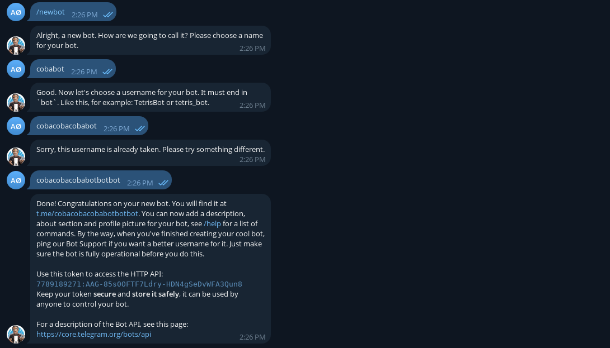
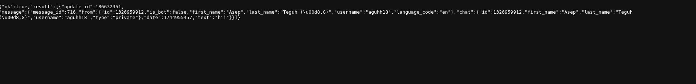
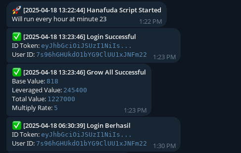

# Hanafuda Auto Grow

🌸 **Hanafuda Auto Login & Grow Script**  
This Python script automates logging into Hanafuda, retrieves an `id_token` using a `refresh_token`, and performs the **Grow All** action periodically every hour at a specified minute. Result notifications are sent to a private Telegram chat via a bot.

✨ **Features**  
- Automatic login to Hanafuda.
- Periodic "Grow All" action.
- Telegram notifications for script results.

## Requirements
- Python 3.7 or higher
- `requests` and `schedule` Python libraries

## Installation

### Clone the Repository
```sh
git clone https://github.com/your-username/hanafuda-auto-script.git
cd hanafuda-auto-script
```

### Install Dependencies
Install the required Python libraries:
```sh
pip install requests schedule
```

### Configure the Script
Edit the `config.txt` file to include your credentials and settings.

#### Linux
```sh
nano config.txt
```
Use the `nano` editor to edit the file. Save by pressing `Ctrl+O`, then `Enter`, and exit with `Ctrl+X`.

#### Windows
```powershell
notepad config.txt
```
Use Notepad to edit the file. Save and close the window when done.

#### Configuration Example
Edit `config.txt` with the following format:
```ini
[DEFAULT]
REFRESH_TOKEN=your-refresh_token
TELEGRAM_BOT_TOKEN=your-bot-token
TELEGRAM_CHAT_ID=your-telegram-chat-id
MINUTE=23
```
- `REFRESH_TOKEN`: Your Hanafuda refresh token.
- `TELEGRAM_BOT_TOKEN`: Your Telegram bot token.
- `TELEGRAM_CHAT_ID`: Your Telegram chat ID.
- `MINUTE`: The minute of each hour when the script runs (e.g., `23` for 23rd minute).

### Obtain the Refresh Token
1. Open the Hanafuda website at [https://hanafuda.hana.network/dashboard](https://hanafuda.hana.network/dashboard).
2. Log in to your account.
3. Open the browser's **Developer Tools**:
   - **Linux/Windows**: Press `F12` or `Ctrl+Shift+I`.
   - Navigate to the **Application** tab.
   - Find the **Storage** or **Local Storage** section, then locate the `refresh_token`.
4. Copy the `refresh_token` and paste it into `config.txt`.



### Obtain the Telegram Bot Token
1. Open Telegram and search for the bot with the username <span style="color: blue;">@BotFather</span>.
2. Start a chat with <span style="color: blue;">@BotFather</span> and send the command <span style="color: gray;">/newbot</span>.
3. Follow the instructions to create a new bot and receive a bot token.
4. Copy the bot token and paste it into `config.txt`.



### Obtain the Telegram Chat ID
1. Open Telegram and send a random message to the bot you just created.
2. Open a browser and navigate to:
   ```
   https://api.telegram.org/bot<your-bot-token>/getUpdates
   ```
   Replace `<your-bot-token>` with the bot token you obtained.
3. In the response, locate the `chat.id` field (e.g., a number like `123456789`).
4. Copy the `chat.id` and paste it into `config.txt`.



### Update config.txt
Ensure all obtained values (`REFRESH_TOKEN`, `TELEGRAM_BOT_TOKEN`, `TELEGRAM_CHAT_ID`) are correctly entered in `config.txt`.

## Run the Script

### Linux
```sh
python3 main.py
```
Run the script using the `python3` command.

### Windows
```powershell
python main.py
```
Run the script using the `python` command (ensure Python is added to your system PATH).

### Script Output
When the script runs successfully, you will receive a notification in your Telegram chat, as shown below:



## Disclaimer
This bot is for educational purposes only. Use at your own risk. The creators of this bot are not responsible for any loss of funds.

## License
MIT License

## Join Our Community
Telegram: https://t.me/+V_JQTTMVZVU3YTM9

